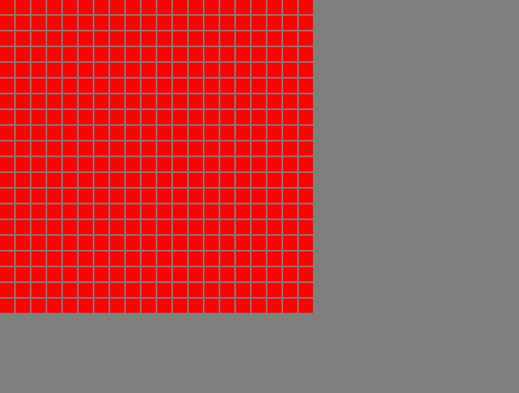

# r_path-finding

This project uses pathfinding algorithms in the 2D grid to find the shortest path to reach the goal.

## Grid
🟥 - Unvisited title 
🟩 - Visited title
🟨 - Start
🟦 - Goal
🟫 - Obstacle

## Algorithm
This project uses following available algorithms:

* BFS (**Breadth-First Search**)

