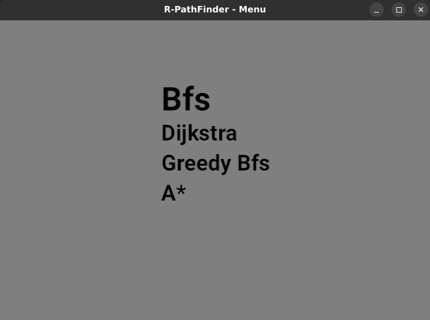
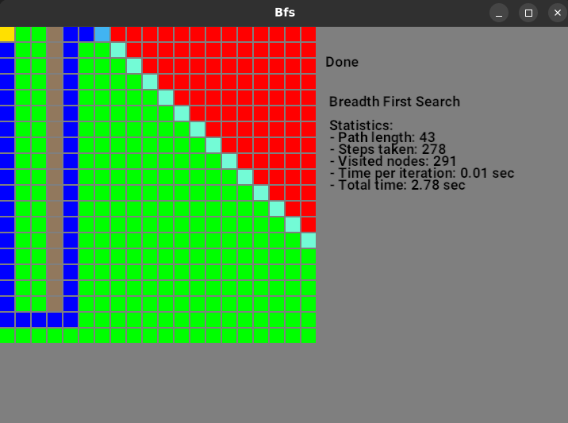
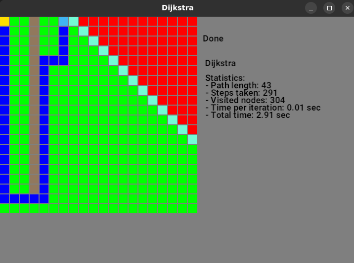
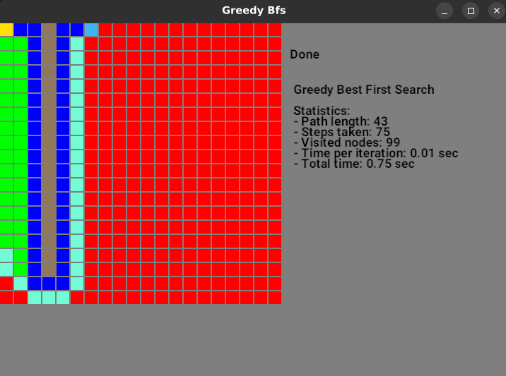
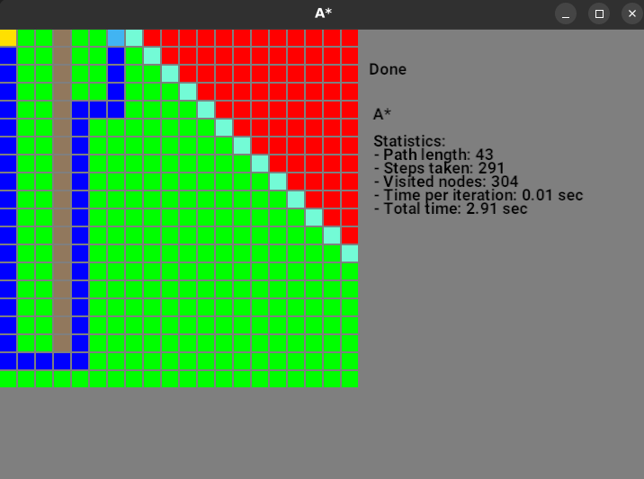

# r_path-finding

This project uses pathfinding algorithms in the 2D grid to find the shortest path to reach the goal.

## Grid

🟥 - Unvisited title
🟩 - Visited title
🟨 - Start
🟦 - Goal
🟫 - Obstacle

## Algorithm

### Menu

 

This project covers following algorithms:

| Algorithm                     | Result                              |
|-------------------------------|-------------------------------------|
| BFS (*Breadth-First Search*)  |          |
| Dijkstra                      |     |
| Greedy Bfs                    |   |
| A*                            |       |

### Results:
All algorithms for the grid behave similarly because the movement cost is equal to one. Therefore, there is no need to use cost algorithms like Dijkstra and A*.
For this purpose, it is better to use Bfs (all costs are the same).
Sometimes Greedy Bfs is the right choice, but it is not guaranteed to find the shortest path

Algorithm Usage:

* **Bfs (*Breadth-First Search*)** - The algorithm explores titles equally in all directions.
* **Dijkstra** - Works well to find the shortest path but explores titles in directions that aren’t promising.
* **Greedy Bfs** - Explores titles in promising directions but it may not find the shortest path.
* **A Star** - Mix of Dijkstra and Greedy Best First Search.

## TODO
- [ ] Implement movement cost into Grid

## Links:

- [redblobgames](https://www.redblobgames.com/pathfinding/a-star/introduction.html)
